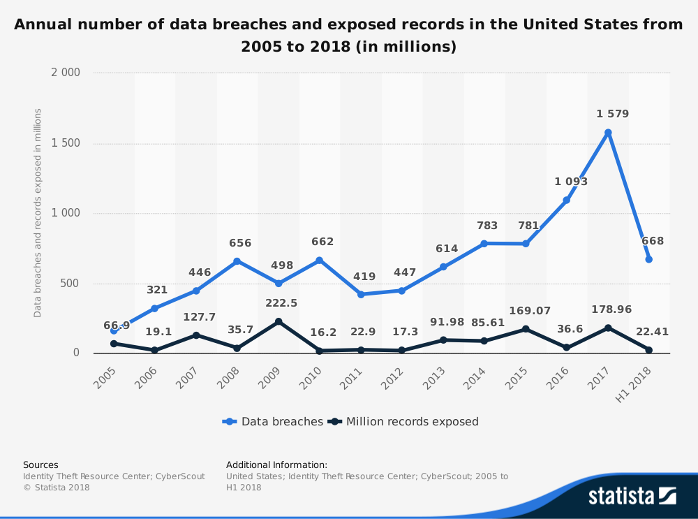

# Zero-knowledge bank

## Idea, motivation and executive summary
Under new GDPR laws, each record of personal/private information (PPI) exposed costs a company $500. 
In 2017 alone, it would've costed all the companies 90 bil for data breaches if prosecuted according to new laws. What if we 
could perform all business functions while *not storing that data*? I'm developing 
a system (dashboard, app) that demonstrates *scalable homomorphic computation* to enable credit card companies 
to offer their services to randomly generated consumers while keeping all data private. This also opens 
up miraculous use cases creating entirely new markets, blue oceans, for people to collaborate privately, 
organize, based on **ultra** private data that was previously untappable. 

## Data source and size
Random generation of *n* transactions between *p* legal entities. Size is arbitrary.
Possibly using the blockchain dataset to approximate real transactions between addresses.

## Tech stack
Client: Progressive web app, likely Vue/React + a scalable Node+express+graphQL/Flask/Django backend.
Data processing via a stream+batch service Flink/Beam/Onyx
Functional, library-focused codebase, likely Clojure/Python/Rust

## Engineering Challenge
Current implementations are C++ low level APIs of binary logic gates, "assembly language" for HFE computation if you will. The challenge will be to build horizontally scalable, distributed, high throughput APIs *and* an MVP which demonstrates this.

## Business value 
Every data leakage carries an immense cost. 
If this provides a comparable cost alternative, 
it makes for a VERY compelling case in a world where any system can be compromised. 

## MVP
A bank-like system, with simulated transactions being recorded with the centralized entity (bank, or perhaps the public) having no knowledge of sender, receiver, amount.
2nd week goal: 1 transaction per second implementation, perhaps with just two participants.

## Stretch Goals
* Explore distributed consensus algorithm with these as PoW. 
* Bank, credit card, credit score based automatic lending decisions for completely trustless financial system
